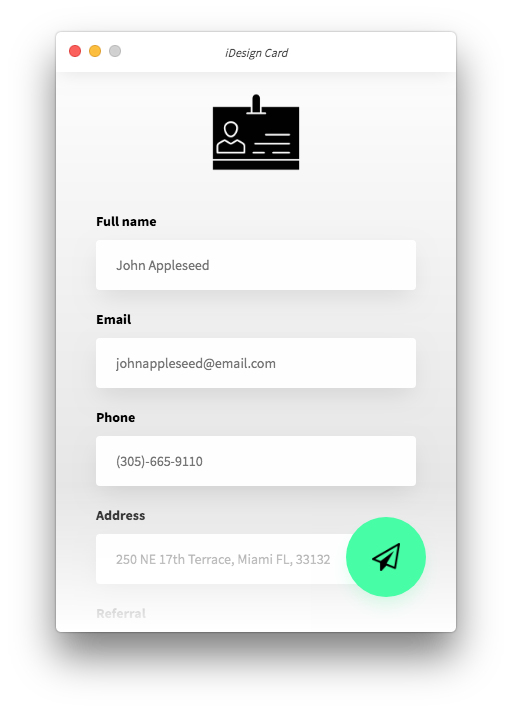
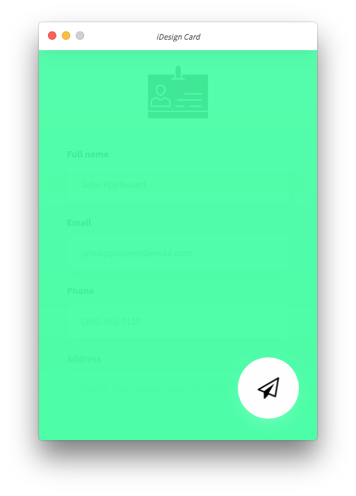
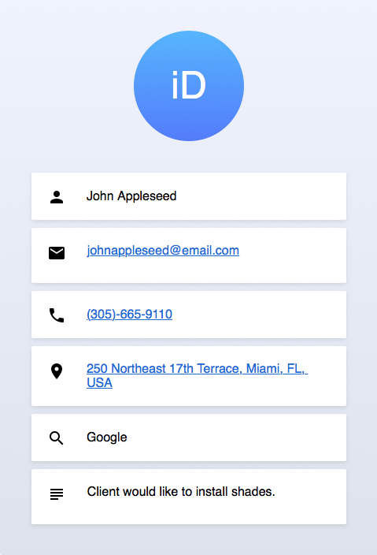

# iDesign Card
A simple app for collecting client information for iDesign Miami. 

Clicking the send button will copy the information in the form to an email template on your clipboard and open up the default email client with pre-filled To and Subject headers. Paste into the body and hit send!

    
    

## Usage
Download or clone the repo and then...

1. `npm install`

2. `npm start`

## Build
To build for any given platform...

1. `npm run compile`

2. `npm run build`

3. `npm run dist`

The HTML email template should look something like the image below with actionable links to phone numbers, emails, and addresses.

    

---
Made with <3 by Carlos Santos.
